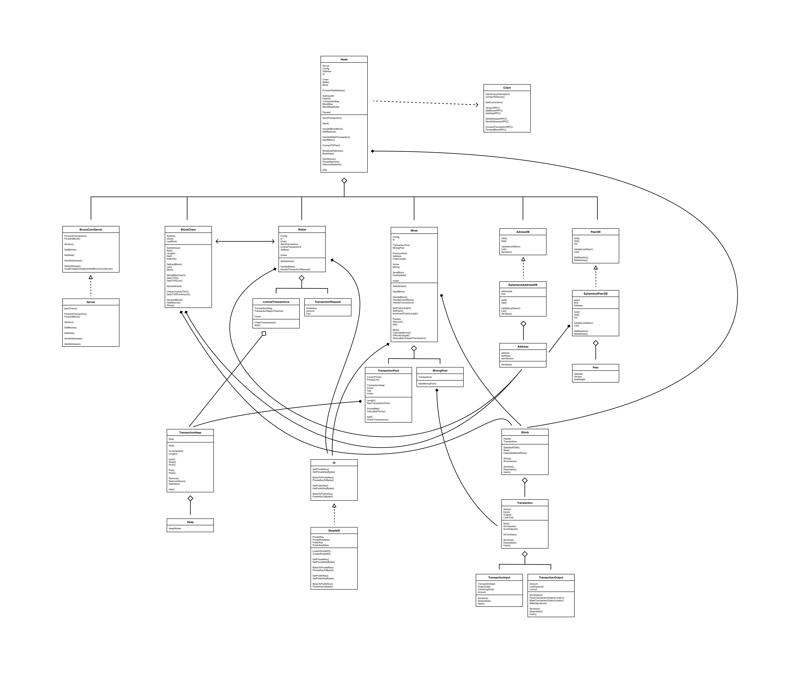

# Description

BrunoCoin is a fully fledged crytpocurrency written in Go. It is a simple implementation of a cryptocurrency, as it is intended for educational purposes. It contains almost all traditional aspects of a cryptocurrency: making transactions, broadcasting transactions/blocks to the network, mining transactions to a block, validation, maintaining the blockchain, etc. However, it is only meant to run on one machine in a multithreaded environment in order to simulate a real network. 

I focused on implementing the miner and validation functionality, which you can find in the `BrunoCoinStencil/pkg/miner` directory and `BrunoCoinStencil/pkg/validation.go` file, respectively. Miner functionality includes the infamous POW algorithm, resulting in a nonce that proves the miner used substantial computing power to propose its new block.

This project was created for Brown University's Blockchain & Cryptocurrencies course. Since this project was developed for Brown University, I am NOT able to share our implementation of the project. However, I am able to share this stencil that we provided to the students.

# Class Structure

BrunoCoin has several interacting classes, as shown by the UML class diagram I've created below:

Here are some brief (alphabetized) explanations for BrunoCoin's main classes. For more in-depth explanations, check out our documentation in the files themselves. For example, if you want to learn more about the miner's functionality (the part that I focused on), take a look at `BrunoCoinStencil/pkg/miner/miner.go`.

- Block: the Chain's way of recording information on Transactions. It is composed of a BlockHeader and a list of Transactions.

- BlockChain: the blockchain handles keeping track of both forked and main chains. It is essentially a wrapper for a map of BlockChainNodes, which contain Blocks and relevant metadata.

- Client: in charge of connecting to other clients using the P2P (peer-to-peer) networkes, as well as propogating information (blocks and transactions) on the network.

- EphemeralAddressDB: An implementation of the AddressDB interface. The EphemeralAddressDB is a wrapper for a map of addresses, along with ways to update and get information from that map.

- EphemeralPeerDB: An implementation of the PeerDB interface. The EphemeralPeerDB is a wrapper for a map of peers, along with ways to update and get information from that map.

- LiminalTransactions: represents the transactions that the wallet has made, but that do not have enough proof of work on top of them to be considered valid by everyone.

- Miner: supports the functionality of mining new transactions broadcast from the network to a new block.

- MiningPool: contains all transactions that the miner is currently mining.

- Node: the interface for interacting with the cryptocurrency. The node handles all top level logic and communication between different pieces of functionality.

- Server: handles requests made by the node. 

- SimpleId: An implementation of the Id interface. The SimpleID is in charge of handling public and private key information.

- Transaction: a record of a transfer of a cryptocurrency from one party to another. It is composed of TransactionInputs and TransactionOutputs.

- TransactionHeap: represents a heap or priority queue for storing transactions.

- TransactionPool: represents all the valid transactions that the miner can mine. It is essentially a wrapper for a TransactionHeap.

- Wallet: Wallet provides the functionality to make transactions from transaction requests and send them to the node to be broadcast on the network.

# Example Functionality 

## Node Receives a Block 

When the Node receives a Block over the network, it must first validate the Block. Once it's been validated, it sends that Block to the BlockChain and to its Miner. 

If the Block appends to the main chain (typical case), then the BlockChain must update its fields accordingly. 

The Miner must then handle the block, which it does by calling HandleBlock(). The transactions on the block need to be checked with the TransactionPool, in case the TransactionPool has any transactions that have already been mined. The miner's perspective of the hash of the last block on the main chain needs to be reset, and the chain length needs to be updated. Lastly, the miner needs to restart.

## Miner Finds Nonce 

Suppose that the Miner wins the race to mine the next Block by finding a "winning" nonce. In order for that Block to be on the consensus "main chain," it must be broadcast to the network and validated by other BlockChains.

To make that broadcast happen, the Miner sends its newly created Block to the Node by use of a Go channel (a pipe). The Node then calls HandleMinerBlock(), which adds the Block to its own main chain and broadcasts the Block to all of its peers. 

## Wallet Creates TransactionRequest

When an owner of BrunoCoin wants to transfer their holdings to another party, they must employ the Wallet to do so. The Wallet creates a TransactionRequest, which is the minimum amount of information needed to make a Transaction.

The Wallet must then handle this TransactionRequest by calling HandleTransactionRequest(). First, the Wallet sends its TransactionRequest to the BlockChain using a Go channel. The BlockChain then must aggregate enough valid UTXO to use as TransactionInputs by calling getUTXOForAmount(). The Wallet then creates the requisite TransactionOutputs and combines them with the TransactionInputs to make a Transaction. 

The Wallet adds this newly formed Transaction to its LiminalTransactions, as it does not yet have any proof of work on top it. The Wallet sends the Transaction to the network to be broadcast to other Nodes, which may have their Miners add this Transaction to their TransactionPools.